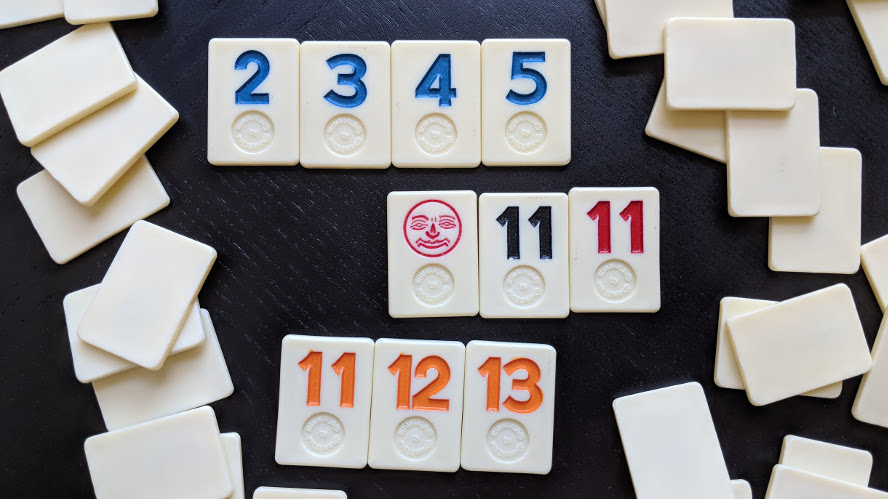

# Tiwe

Tiwe (*/'taɪwiː/*) is a distributed multiplayer board game with a gameplay
similar to [Rummikub](https://en.wikipedia.org/wiki/Rummikub).



https://en.wikipedia.org/wiki/Mental_poker

## Building

```
go get github.com/rhcarvalho/tiwe
```

## Playing

Start a local player:

```
$ tiwe -name Rodolfo [-connect <addr>]
... Waiting for a friend to connect to xxx.xxx.xxx.xxx:xxx
... Ludmila joined the game!
> new Sunday Fun
... Created new game "Sunday Fun"!
... Shuffling tiles...
... Deciding who starts...
... Rodolfo rolls: 3                   (wait some time for suspense)
... Ludmila rolls: 6
... Ludmila starts!
> hand
1R, 4G, 5B, 6Y, ...
> board
empty
```


## Notes:

- This is related to the Mental Poker problem.

- Encryption with XOR is not encryption, easy to find key if you know plaintext: https://play.golang.org/p/v8NGFUAlY-k
